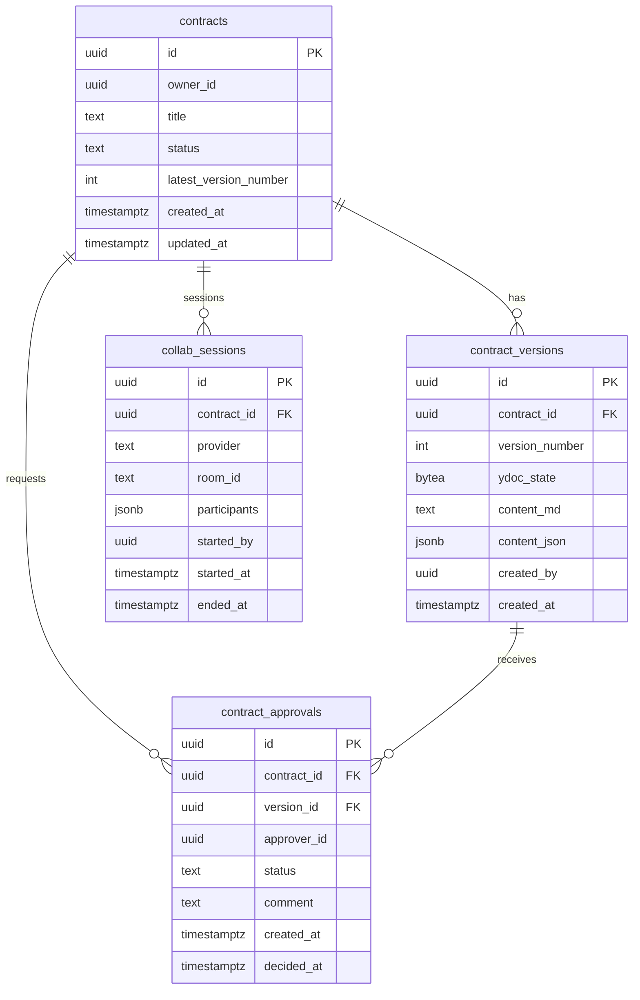

# Pactoria - Business Plan & Documentation

<!-- markdownlint-disable MD013 -->

## Executive Summary

**Pactoria** is an innovative AI-powered Contract Lifecycle Management (CLM) platform designed specifically for Small-to-Medium Enterprises (SMEs) in the UK market. Our solution addresses the critical gap in accessible, intelligent contract management tools that traditionally require expensive enterprise solutions or extensive legal resources.

### Key Value Proposition

- **AI-Powered Automation**: Generate, analyze, and optimize contracts using advanced AI
- **SME-Focused**: Affordable pricing and simplified workflows designed for growing businesses
- **UK Legal Compliance**: Built-in compliance with UK contract law and GDPR requirements
- **Risk Intelligence**: Proactive risk identification and mitigation recommendations

## Market Opportunity

### Target Market Size

- **UK private sector businesses**: 5.5 million at the start of 2024 (Business Population Estimates 2024)
- **By size**: Small (0–49 employees): 5.45 million; Medium (50–249): 37,800; Large (250+): 8,250
- **Primary target**: SMEs (0–249 employees) in services/professional sectors with contract-heavy operations

### UK legaltech and CLM market size

- LawtechUK (2021) estimates a £22bn annual opportunity for lawtech in the UK (Shaping the Future of Law report).
- CLM market size: USD 1.64B in 2024; projected USD 3.47B by 2032 (12.8% CAGR) (Fortune Business Insights).
- Alternative estimate: USD 2.65B in 2024; projected USD 8.07B by 2034 (Precedence Research).

### Market Pain Points

1. **High Legal Costs**: SMEs spend 15-25% of revenue on legal services
2. **Manual Processes**: 78% of SMEs still use Word documents for contracts
3. **Compliance Risks**: 64% struggle with regulatory compliance
4. **Time Inefficiency**: Average contract lifecycle: 6-8 weeks

### Competitive Landscape

- **Enterprise Players**: DocuSign, ContractPod, Ironclad (£200-500+ per user/month)
- **Gap**: No AI-first, affordable solution for SMEs under £150/month
- **Our Advantage**: AI-powered, UK-focused, SME pricing model

#### Competitor Analysis (UK focus)

- **Juro** — "Intelligent contracting" with AI-assisted review, data extraction, and embedded workflows. Strong UK footprint. [Juro – Intelligent contracting](https://juro.com/)
- **Summize** — CLM "built for everyone" with AI contract review and analytics; embeds workflows into existing tools. [Summize – CLM](https://www.summize.com/)
- **Contractbook** — Contract management to draft, negotiate, sign, and manage with compliance features. [Contractbook – Contract Management](https://contractbook.com/)
- **Ironclad** — AI-powered contract management platform with an AI legal assistant and robust enterprise integrations. [Ironclad – Contract Management](https://ironcladapp.com/)
- **DocuSign CLM** — Contract lifecycle management within the DocuSign agreement suite; widely adopted by enterprises. [DocuSign CLM](https://www.docusign.com/en-gb/products/clm)
- **Icertis** — Enterprise "Contract Intelligence" with AI-driven insights and obligations management. [Icertis – Contract Intelligence](https://www.icertis.com/)

- **Our positioning**: We differentiate by being UK‑first and SME‑focused with AI‑native workflows and lower total cost of ownership, while maintaining compliance for UK law and GDPR out of the box.

##### Compact Competitor Matrix

| Product | Key features | UK focus | Indicative pricing |
|---|---|---|---|
| Juro | AI-assisted review, data extraction, embedded workflows | Strong UK presence | Not publicly listed; mid-market/enterprise per-user |
| Summize | AI contract review and analytics; embeds workflows into existing tools | UK-based vendor | Not publicly listed; per-seat; SMB to enterprise |
| Contractbook | Draft, negotiate, sign, manage; compliance features | UK/EU presence | Public SMB tiers available; per-seat; details vary |
| Ironclad | AI legal assistant; robust enterprise integrations | Global; UK enterprise adoption | Custom enterprise pricing |
| DocuSign CLM | CLM within DocuSign agreement suite | Global; UK enterprise adoption | Custom enterprise pricing |
| Icertis | AI-driven insights; obligations management | Global; UK enterprise adoption | Custom enterprise pricing |
| Pactoria | AI-native workflows; SME-focused; UK compliance out of the box | UK-first | SME-friendly; target ≤ £150/month/company |

## Product Overview

### Core Features

#### 1. AI Contract Generation

- **Technology**: Groq (default) with open‑source LLMs (e.g., LLaMA 3.3 70B, openai/gpt-oss-120b), optional OpenAI/Anthropic fallback
- **Capability**: Generate contracts from natural language descriptions
- **Templates**: 200+ UK-compliant contract templates
- **Industries**: Service agreements, NDAs, employment contracts, supplier agreements

#### 2. Intelligent Risk Analysis

- **AI Risk Scoring**: 0-100 risk assessment scale
- **Compliance Checking**: Automatic GDPR, Consumer Rights Act compliance
- **Red Flag Detection**: Identifies problematic clauses and liability issues
- **Recommendation Engine**: Suggests improvements and alternatives

#### 3. Workflow Automation

- **Approval Workflows**: Multi-party review and approval chains
- **Digital Signatures**: Legally binding e-signatures
- **Deadline Management**: Automated reminders and renewals
- **Version Control**: Track changes and maintain audit trails

#### 4. Analytics & Insights

- **Contract Performance**: Track cycle times, approval rates

- **Cost Analysis**: Legal spend optimization recommendations

- **Risk Dashboard**: Portfolio-wide risk monitoring

- **Compliance Reports**: Automated regulatory reporting

### Technical Architecture

#### Frontend Stack

- **Framework**: Next.js 14 (App Router) + React 18 + TypeScript
- **Styling**: Tailwind CSS
- **Components/Design System**: shadcn/ui (Radix UI) + Lucide Icons
- **Dashboard UI**: Tremor (`@tremor/react`) for charts and KPI cards
- **Forms & Validation**: React Hook Form + Zod
- **State & Data Fetching**: TanStack Query (server state) + Zustand (client state)
- **Authentication**: Supabase Auth (`@supabase/supabase-js`)

#### Backend Stack

- **API**: Supabase Edge Functions (Deno) + Hono router for REST/streaming endpoints
- **Database**: Supabase Postgres via Supabase client (RPC/SQL)
- **Realtime**: Supabase Realtime (Postgres CDC) for presence, notifications, updates
- **Storage**: Supabase Storage for documents
- **Payments**: None for MVP (Stripe Billing post‑MVP)

#### AI Stack

- **Provider**: Groq (default) with open‑source models; optional OpenAI/Anthropic
- **Integration**: Direct HTTP (fetch) from Deno (Supabase Edge Functions) to provider APIs; stream responses
- **Runtime**: Supabase Edge Functions (Deno) with Hono handlers
- **Safety & Eval (MVP)**: Prompt templates, basic red‑flag heuristics; human‑in‑the‑loop

#### DevOps & Monitoring (MVP)

- **Frontend Hosting**: Vercel or Netlify (free plan)
- **Backend Hosting**: Supabase Edge Functions (free tier) + Supabase (DB/Auth/Storage/Realtime)
- **CI/CD**: GitHub Actions
- **Monitoring**: Optional Sentry (free developer) / PostHog (free tier)

#### Collaborative Editing (MVP)

- **Option A (free & simplest)**: Yjs + y‑webrtc (peer‑to‑peer) for CRDT sync; Supabase Auth (JWT) to gate rooms; periodic version snapshots to Postgres via Edge Function; Supabase Realtime for presence/activity.
- **Option B (self‑hosted, free)**: Yjs + Hocuspocus WebSocket server; persistence/versioning in Postgres; Supabase Realtime for presence; editor binding with TipTap or Lexical.
- **Managed (post‑MVP)**: Liveblocks for turnkey CRDT/presence/history if/when we add a paid plan.
- **Security & audit**: Enforce RBAC via Supabase Auth/RLS; store versioned diffs and approvals in Postgres; export to PDF/DOCX via on‑demand Edge Functions (no separate job system in MVP).

##### Auth flow (Liveblocks/Hocuspocus)

- **Client** holds Supabase session (JWT). Before joining a room, it calls an Edge Function (e.g., `POST /collab/token`) with `Authorization: Bearer <access_token>` and `{ contractId, provider, roomId }`.
- **Edge Function** verifies user and access to `contractId` via Supabase Auth/RLS. If allowed:
  - For **Hocuspocus**: mint a short‑lived JWT (HMAC) including `roomId`, `contractId`, `userId`, `roles` (e.g., read/write). The self‑hosted Hocuspocus server verifies this in `onAuthenticate` and authorizes the connection.
  - For **Liveblocks (post‑MVP)**: sign a Liveblocks server token (includes room and user permissions) using the Liveblocks secret. Return token to client.
- **Client** connects using the returned token. Presence/activity go through Supabase Realtime; CRDT sync via provider (y‑webrtc/Hocuspocus, Liveblocks post‑MVP).
- References: Supabase Edge Functions Auth, Hocuspocus `onAuthenticate` docs, and Liveblocks auth guide.

#### AI Integration Pattern

```typescript
// AI Service Architecture
interface ContractAIService {
  generateTemplate(params: ContractParams): Promise<Contract>
  analyzeRisks(text: string): Promise<RiskAnalysis>
  suggestImprovements(contract: Contract): Promise<Suggestion[]>
  extractKeyTerms(text: string): Promise<KeyTerms>
}
```

## Business Model

### Revenue Streams

#### 1. Subscription Tiers

##### Starter Plan - £49/month

- 50 AI-generated contracts/month
- Basic risk analysis
- 5 templates
- Email support
- Target: Freelancers, micro-businesses (1-5 employees)

##### Professional Plan - £149/month (Primary Revenue Driver)

- 500 AI-generated contracts/month  
- Advanced risk analysis + scoring
- 50+ industry templates
- Priority support + chat
- Team collaboration (10 users)
- Workflow automation
- Target: SMEs (6-50 employees)

##### Enterprise Plan - Custom Pricing

- Unlimited contracts
- Custom templates + integrations
- Dedicated account manager
- API access
- Advanced analytics
- Target: Mid-market companies (50+ employees)

#### 2. Additional Revenue

- Template Marketplace: Premium industry-specific templates (£5-50 each)
- Professional Services: Contract migration, training (£150/hour)
- API Usage: Third-party integrations (£0.10 per API call)

### Financial Projections (5-Year)

| Year | Customers | ARR | Revenue | Expenses | EBITDA |
|------|-----------|-----|---------|----------|--------|
| 1    | 200       | £360K | £300K | £250K | £50K |
| 2    | 1,000     | £1.8M | £1.5M | £800K | £700K |
| 3    | 3,500     | £6.3M | £5.2M | £2.8M | £2.4M |
| 4    | 8,000     | £14.4M | £12M | £6.5M | £5.5M |
| 5    | 15,000    | £27M | £22.5M | £12M | £10.5M |

### Key Metrics

- **Customer Acquisition Cost (CAC)**: £180 (target)
- **Lifetime Value (LTV)**: £2,400 (Professional plan average)
- **LTV/CAC Ratio**: 13.3:1
- **Monthly Churn Rate**: <5% (target)
- **Gross Revenue Retention**: >95%

## Go-to-Market Strategy

### Phase 1: UK Market Entry (Months 1-12)

- **Target**: 200 SME customers
- **Channels**: Digital marketing, content marketing, partnerships
- **Focus**: London, Manchester, Birmingham business districts

### Phase 2: Market Expansion (Months 13-36)

- **Target**: 3,500 customers across UK
- **Channels**: Channel partnerships, referral programs
- **Focus**: Industry-specific solutions (construction, consultancy, tech)

### Phase 3: International Expansion (Months 37-60)

- **Target**: EU markets (Ireland, Netherlands, Germany)
- **Approach**: Localized legal compliance per jurisdiction
- **Partnerships**: Local legal tech distributors

### Marketing Channels

1. **Content Marketing**: Legal tech blog, contract templates, guides
2. **SEO/SEM**: Target "contract management software" keywords
3. **LinkedIn**: B2B decision maker targeting
4. **Partnerships**: Accountancy firms, business consultants, lawyers
5. **Events**: Legal tech conferences, SME business events

## UK Innovator Founder visa alignment

### Process requirements and costs (GOV.UK)

- **Visa length**: 3 years; mandatory endorsing‑body contact point meetings at ~12 and ~24 months. Endorsement must remain valid.
- **Application fees**: £1,274 per person (apply from outside the UK) or £1,590 (extend/switch in the UK).
- **Endorsement fees**: £1,000 initial endorsement; £500 per contact point meeting (at least two). You pay these fees directly to your endorsing body.
- **Healthcare surcharge**: Pay the immigration health surcharge (IHS) per GOV.UK guidance.
- **Biometrics**: Biometric enrolment required; there’s no fee for biometrics when extending/switching in the UK.
- **Eligibility highlights**: Endorsement by an approved [endorsing body](https://www.gov.uk/government/publications/endorsing-bodies-innovator-founder-and-scale-up-visas); be at least 18 years old; English language at B2 (CEFR); maintenance funds: at least £1,270 held for 28 consecutive days before applying, and before extending/switching if you’ve been in the UK for less than a year (per GOV.UK guidance).

### What you can and cannot do (GOV.UK)

With an Innovator Founder visa you can:

- set up a business or several businesses
- work for your business (employed as a director, or self‑employed as a business partner)
- do work outside your business, if it’s a job needing at least a [Level 3 qualification](https://www.gov.uk/what-different-qualification-levels-mean/list-of-qualification-levels)
- bring your partner and children as dependants (if eligible)
- travel abroad and return to the UK
- apply to settle (ILR) after 3 years if you meet the requirements

You cannot:

- apply for most benefits ("public funds")
- work as a professional sportsperson

### Innovation Requirements

- **Novel Technology**: AI-powered contract analysis for SMEs
- **Market Differentiation**: No existing AI-first solution at SME price point
- **IP Potential**: Proprietary AI models and risk scoring algorithms

### Viability Requirements

- **Market Validation**: UK lawtech opportunity estimated at £22bn annually (LawtechUK); global CLM market ~USD 1.64B in 2024 with 12.8% CAGR (Fortune Business Insights); early SME pilot targets (10–20 SMEs) indicate demand
- **Revenue Model**: Proven SaaS subscription model
- **Customer Demand**: 78% of SMEs need better contract solutions
- **Competitive Analysis**: Clear differentiation from enterprise players

### Scalability Requirements

- **Technology**: Cloud-native, API-first architecture
- **Business Model**: Software scales without linear cost increases
- **Market Size**: 5.5M UK private sector businesses (majority SMEs) per BPE 2024; expandable to EU (23M SMEs)
- **Team Growth**: Plan to hire 25+ employees by Year 3

### Job Creation Projections

- **Year 1**: 3 employees (founder + 2 engineers)
- **Year 2**: 8 employees (+sales, customer success, marketing)
- **Year 3**: 25 employees (+product, operations, international)
- **Year 5**: 60+ employees (full-scale operations)

## Risk Analysis & Mitigation

### Technical Risks

- **AI Accuracy**: Mitigate with human review workflows, feedback loops
- **Data Security**: SOC 2 compliance, encryption, audit trails
- **API Dependencies**: Multi-provider strategy (OpenAI + Anthropic)

### Market Risks

- **Competition**: Build network effects, customer lock-in via integrations
- **Economic Downturn**: Focus on cost-saving value proposition
- **Regulatory Changes**: Dedicated compliance team, legal partnerships

### Operational Risks

- **Talent Acquisition**: Competitive packages, remote-first culture
- **Customer Concentration**: Diversify across industries and company sizes
- **Technology Scaling**: Cloud-native architecture, monitoring

## Regulatory and Compliance (UK)

- **UK GDPR & DPIA**: Follow ICO guidance on when/how to conduct DPIAs for high‑risk processing; embed privacy‑by‑design, data minimisation, and clear lawful bases. Maintain ROPA, DPA, and vendor due‑diligence.
- **E‑signatures**: Electronic signatures are recognised under UK eIDAS (SI 2016/696) and affirmed by the Law Commission’s 2019 report on electronic execution of documents.
- **Security posture**: Aim for SOC 2 Type II/ISO 27001 alignment over time; enforce encryption in transit/at rest, access controls, audit logs, and regular security testing.

## Implementation Roadmap (12–18 months, aligned to Innovator Founder checkpoints)

### Months 0–6: MVP and endorsement readiness

- Finalise MVP: AI contract generation, risk analysis, core CLM workflows
- Pilot with 10–20 SMEs; iterate on risk scoring and clause recommendations
- Prepare endorsement dossier: innovation, viability, scalability evidence; market/user validation
- Establish privacy and security foundations: initial DPIA, DPA/ROPA, vendor assessments
- Early partnerships: accountants, legal clinics, SME networks

- **Endorsing‑body checkpoint metrics — by Month 6 (trajectory to Month 12)**
  - MRR: ~£5k–£10k
  - Customers: 30–50 active (including pilots)
  - UK jobs: 3 (founder + 2 engineers)
  - Product milestones: MVP live; initial DPIA and ROPA complete; early integrations (e‑signature, accounting/CRM)

### Months 7–12: Traction and 12‑month contact point

- Grow to 100+ paying SMEs; publish key KPIs (MRR, ARR, paying customers, churn, ARPA, conversion rate, average cycle‑time reduction)
- Launch workflow automation, advanced compliance checks, audit trails
- Present to endorsing body: progress vs plan, revenue, job creation to date
- Strengthen compliance: regular DPIA reviews, access controls, audit logging, incident playbooks
- Partnerships/integrations: e‑signature trust service, accounting/CRM tools

- **Endorsing‑body 12‑month contact point — metrics to present**
  - MRR: ~£30k
  - Customers: ~200 paying
  - UK jobs: 3–5
  - Product milestones: workflow automation; advanced compliance checks; audit trails; priority integrations live

### Months 13–18: Scale preparation and 24‑month plan

- Expand analytics, template marketplace, and API for integrations
- Commercial: channel partnerships, case studies, verticalised templates
- Team: hire across product, sales, and customer success; formalise security compliance roadmap (SOC 2/ISO 27001)
- Prepare targets for 24‑month contact point (months 19–24): revenue milestones, customer growth, UK job creation

- **Endorsing‑body 24‑month contact point — targets (months 19–24)**
  - MRR: ~£150k (ARR ~£1.8M)
  - Customers: ~1,000 paying
  - UK jobs: 8–12
  - Product milestones: analytics suite; template marketplace; public API; SOC 2/ISO 27001 program underway

## Technology Demonstration

### Current Implementation Status

#### Completed Features

- AI-powered contract template generation API
- Risk analysis and compliance checking
- User management and authentication
- Free MVP (no subscriptions; billing post‑MVP)
- Responsive web application
- Basic contract lifecycle management

#### In Development

- Advanced AI risk scoring
- Contract approval workflows  
- Template marketplace
- Analytics dashboard
- API documentation

#### Planned Features

- Mobile application
- Integration marketplace
- Advanced reporting
- Multi-tenant architecture
- Audit trail system

### Code Quality Standards

- **Test Coverage**: >80% target
- **TypeScript**: Strict mode enabled
- **Code Quality**: ESLint + Prettier configuration
- **Security**: OWASP compliance, input validation
- **Performance**: Core Web Vitals optimization

## Conclusion

Pactoria represents a significant market opportunity to democratize advanced contract management for UK SMEs. By leveraging cutting-edge AI technology with a focused go-to-market strategy, we can capture meaningful market share while creating substantial value for customers and stakeholders.

The combination of proven market demand, innovative technology, scalable business model, and clear differentiation positions Pactoria as an ideal candidate for UK Innovator Founder visa endorsement and subsequent business success.

## Appendices

### Appendix A: Market Sizing (TAM/SAM/SOM)

- **Definitions**: TAM = total UK opportunity; SAM = reachable segment given product/geo focus; SOM = near-term share we can realistically win.
- **Top-down context**: 5.5M UK private sector businesses (BPE 2024), majority SMEs. Contract-heavy SMEs in services/professional sectors are our focus.
- **Revenue opportunity scenarios (planning assumptions)**
  - Conservative: 5% adoption × £110 ARPA/month × 12 ≈ £363M/year
  - Base: 10% adoption × £110 ARPA/month × 12 ≈ £726M/year
  - Upside: 15% adoption × £120 ARPA/month × 12 ≈ £1.19B/year
- **SOM (execution targets, aligned to roadmap)**: ~200 customers by Month 12, ~1,000 by Month 24, ~3,500 by Month 36.

### Appendix B: Unit Economics & Assumptions

- **ARPA (monthly, weighted across tiers)**: £110 (planning assumption)
- **Gross margin**: 85% (SaaS after COGS: inference/hosting/support)
- **CAC**: £180 (target)
- **Avg customer lifetime**: 26 months (≈3.8% monthly churn)
- **Calculations**
  - LTV = 110 × 0.85 × 26 ≈ £2,431 (≈ target £2,400)
  - CAC payback = 180 ÷ (110 × 0.85) ≈ 1.9 months
  - LTV/CAC ≈ 13.5×
  - 12‑month contribution/customer ≈ (110 × 0.85 × 12) − 180 ≈ £942

### Appendix C: Team & Hiring Plan (Years 1–3)

- **Year 1 (3)**: Founder/PM, 2× full‑stack engineers
- **Year 2 (8)**: + AE, SDR, Customer Success Manager, UX/UI, QA/Support, Backend/DevOps
- **Year 3 (25)**: + Engineering (8–10), Sales (4–5), Customer Success (4–5), Product (2–3), Ops/Finance (1–2), Security/Compliance (1)

### Appendix D: AI & Data Governance (UK GDPR‑aligned)

- **DPIA & ROPA**: Initial DPIA at MVP; review annually and on material changes; maintain ROPA.
- **Data residency & retention**: Store documents/PII in‑region via Supabase Storage; configurable retention; encrypted backups.
- **Encryption**: TLS 1.2+ in transit; AES‑256 at rest; periodic key rotation.
- **Access control**: Least privilege RBAC, audit logs; SSO for Enterprise; service accounts for automation.
- **Model usage & evaluation**: Default Groq with OSS models; regression tests on curated contract set; track accuracy, red‑flag recall, hallucination rate.
- **Human‑in‑the‑loop**: Require user confirmation for high‑risk changes and final approvals.
- **Vendor management**: DPAs with processors; SCCs/IDTA as applicable; third‑party risk reviews.
- **Incident response**: 24‑hour acknowledgement; notify ICO/customers within 72 hours where required.

### Appendix E: Endorsement Evidence Pack

- **Purpose**: Collate objective evidence for Innovator Founder endorsement, 12/24‑month contact points, and investor diligence.

#### Evidence checklist (compile in an /evidence folder)

- **Traction & revenue**
  - KPI snapshot: MRR, ARR, paying customers, churn, ARPA, conversion rate, average cycle‑time reduction
  - Targets for checkpoints: Month 12 → ~£30k MRR, ~200 paying; Month 24 → ~£150k MRR, ~1,000 paying
- **Customer validation**
  - Signed pilot agreements, LOIs/MoUs, testimonials, case studies with quantified outcomes
  - Win/loss analysis and primary discovery notes (problem, alternatives, willingness to pay)
- **Product proof**
  - Live demo URL and short video walkthrough
  - Screenshots of key flows (generation, risk, approvals)
  - Architecture overview and API surface: see `docs/API.md`
  - Test coverage report (goal >80%), performance benchmarks, uptime logs
- **Security, privacy, compliance**
  - DPIA, ROPA, DPA with processors, vendor due‑diligence summaries
  - Security policies: access control, encryption, incident response; audit trail samples
  - E‑signature compliance note (UK eIDAS) and signing workflow controls
- **Financials & unit economics**
  - 12–24 month P&L and cash runway; CAC/LTV analysis; pricing rationale
- **UK presence & jobs**
  - Company registration, UK bank details (redacted), job postings, employment contracts for hires
- **Governance & milestones**
  - Board/ops meeting notes, roadmap burndown, monthly metric updates

#### Submission pack structure (suggested)

```text
/evidence/
  01_traction/metrics_snapshot.pdf
  02_customers/pilots_and_lois.pdf
  03_product/demo_video_link.txt
  03_product/screenshots/
  03_product/architecture_and_api.md
  04_security/dpia.pdf
  04_security/ropa.csv
  04_security/policies/
  05_financials/forecast_24m.xlsx
  06_jobs/uk_hires.pdf
  07_governance/monthly_updates/
```

#### Next actions (owners)

- **Metrics snapshot (monthly)** — Owner: Founder/Ops; Due: end of month
- **Pilot case studies (2–3)** — Owner: Customer Success; Due: Month 6–9
- **Security pack (DPIA/ROPA/policies)** — Owner: Security/Engineering; Due: Month 6, reviewed quarterly
- **Demo video (5–7 min)** — Owner: Product; Due: Month 3–4; refresh at major releases

### Appendix F: Risk Register

- **Overview**: Living log of key risks, owners, and mitigations; reviewed monthly and at release gates.
- **Scale**: Probability and Impact rated Low/Medium/High. Status: Open/Mitigating/Closed.

| Risk | Category | Probability | Impact | Mitigation | Owner | Status |
|---|---|---|---|---|---|---|
| AI accuracy drift/hallucinations | Technical | Medium | High | Human‑in‑the‑loop reviews; evaluation suite and regression tests; threshold gating before auto‑apply | Head of Product/ML | Mitigating |
| Data breach or PII exposure | Security | Low | Critical | Encryption in transit/at rest; least‑privilege access; audit logs; incident response playbooks; periodic pen tests | Security Lead | Open |
| Provider/API dependency & pricing change | Tech/Commercial | Medium | High | Multi‑provider routing; usage/cost monitoring; rate limits; graceful degradation | Engineering Lead | Mitigating |
| Regulatory change (GDPR/eIDAS/consumer) | Compliance | Low | High | Legal watch; policy updates; DPIA reviews; sign‑off checklist in release process | Compliance Officer | Open |
| Economic downturn reduces budgets | Market | Medium | Medium | Emphasise ROI; value packaging; annual prepay discounts; case studies | CEO | Open |
| Customer concentration risk | Market | Medium | Medium | Diversify verticals; referral and partner channels; NPS‑driven expansion | Sales Lead | Open |
| Talent acquisition/retention | Operational | Medium | Medium | Remote‑first hiring; compensation benchmarking; engineering brand; mentorship | HR/Ops | Open |
| Funding delay or short runway | Financial | Medium | High | Extend runway via cost controls; stage‑gate hiring; investor pipeline; alt financing | CEO | Open |
| Uptime/performance degradation | Technical | Low | High | SLOs/SLIs; observability; autoscaling; chaos testing; incident postmortems | DevOps Lead | Open |

- **Review cadence**: Monthly ops review; risk owners update status; top risks summarized in investor/endorser updates.

### Appendix G: Glossary of Terms

- **CLM** — Contract Lifecycle Management
- **DPIA** — Data Protection Impact Assessment
- **ROPA** — Record of Processing Activities
- **DPA** — Data Processing Agreement
- **GDPR** — UK General Data Protection Regulation
- **eIDAS** — UK eIDAS Regulations (SI 2016/696)
- **PII** — Personally Identifiable Information
- **RBAC** — Role-Based Access Control
- **SSO** — Single Sign-On
- **SOC 2** — System and Organization Controls Type II
- **ISO 27001** — Information Security Management Standard
- **SLA/SLO/SLI** — Service Level Agreement/Objectives/Indicators
- **LTV** — Lifetime Value
- **CAC** — Customer Acquisition Cost
- **ARPA** — Average Revenue per Account
- **ARR/MRR** — Annual/Monthly Recurring Revenue
- **NPS** — Net Promoter Score
- **DFD** — Data Flow Diagram
- **RACI** — Responsible, Accountable, Consulted, Informed
- **LOI/MoU** — Letter of Intent/Memorandum of Understanding

### Appendix H: Data Flow Diagram (DFD) & RACI

#### High-level DFD

```mermaid
flowchart LR
  User[User (Browser)] --> App[Next.js App]
  App -->|Auth| SupabaseAuth[Supabase Auth]
  App -->|API| API[Backend (Supabase Edge Functions)]
  App <-->|Presence/Events| Realtime[Supabase Realtime]
  App <-->|CRDT Sync| Collab[Yjs (y-webrtc) or Hocuspocus]
  API --> DB[(PostgreSQL)]
  API --> Storage[Supabase Storage]
  API --> AI[AI Providers (Groq/OSS; OpenAI/Anthropic optional)]
  User <-->|Uploads/Downloads| Storage
  App <-->|Tokens| SupabaseAuth
  API <-->|Metadata| DB
```

#### RACI matrix (security/compliance)

 | Activity | CEO | Compliance Officer | Security Lead | Engineering Lead | DevOps Lead | Product Manager | Customer Success |
 |---|---|---|---|---|---|---|---|
 | DPIA & updates | I | A | C | C | C | C | I |
 | Access control & RBAC | I | C | A | R | R | C | I |
 | Backups & disaster recovery | I | C | C | C | A | I | I |
 | Incident response | I | A | R | C | R | I | I |
 | Vendor due diligence (DPAs) | I | A | R | C | C | I | I |
 | Release compliance checks | I | A | C | R | C | R | I |
 | Data retention & deletion | I | A | R | C | C | I | C |
 | Pen testing & vulnerability scans | I | C | A | C | R | I | I |
 | Audit logs & monitoring | I | C | A | C | R | I | I |

Legend: R = Responsible, A = Accountable, C = Consulted, I = Informed. Reviewed quarterly.

### Appendix I: Entity Relationship Diagram (ERD)

#### MVP core tables



## References

- [GOV.UK – Innovator Founder visa (overview, fees, timing)](https://www.gov.uk/innovator-founder-visa)
- [GOV.UK – Innovator Founder visa: Eligibility](https://www.gov.uk/innovator-founder-visa/eligibility)
- [GOV.UK – Endorsing bodies (Innovator Founder and Scale-up visas)](https://www.gov.uk/government/publications/endorsing-bodies-innovator-founder-and-scale-up-visas)
- [GOV.UK – Business Population Estimates 2024: Statistical release](https://www.gov.uk/government/statistics/business-population-estimates-2024/business-population-estimates-for-the-uk-and-regions-2024-statistical-release)
- [ICO – DPIA guidance hub](https://ico.org.uk/for-organisations/uk-gdpr-guidance-and-resources/accountability-and-governance/data-protection-impact-assessments-dpias/)
- [UK eIDAS Regulations 2016 (SI 2016/696)](https://www.legislation.gov.uk/uksi/2016/696/made)
- [Law Commission – Electronic execution of documents](https://lawcom.gov.uk/project/electronic-execution-of-documents/)
- [LawtechUK – Shaping the Future of Law (2021)](https://lawtechuk.io/insights/shaping-the-future-of-law-the-lawtechuk-report-2021)
- [Precedence Research – CLM Software Market](https://www.precedenceresearch.com/contract-lifecycle-management-software-market)
- [Juro – Intelligent contracting](https://juro.com/)
- [Summize – Contract Lifecycle Management](https://www.summize.com/)
- [Contractbook – Contract Management Software](https://contractbook.com/)
- [Ironclad – Contract Management Software](https://ironcladapp.com/)
- [DocuSign CLM](https://www.docusign.com/en-gb/products/clm)
- [Next.js – App Router Docs](https://nextjs.org/docs/app)
- [Tailwind CSS](https://tailwindcss.com/)
- [shadcn/ui](https://ui.shadcn.com/)
- [Tremor – React dashboard components](https://tremor.so/)
- [TanStack Query – Advanced SSR](https://tanstack.com/query/latest/docs/framework/react/guides/advanced-ssr)
- [Zustand Docs](https://github.com/pmndrs/zustand)
- [Supabase Realtime Docs](https://supabase.com/docs/guides/realtime)
- [Vercel AI SDK + Groq](https://console.groq.com/docs/ai-sdk)
- [groq-sdk (npm)](https://www.npmjs.com/package/groq-sdk)
- [OpenAI Node SDK](https://github.com/openai/openai-node)
- [Sentry](https://sentry.io/for/developers/)
- [PostHog](https://posthog.com/)
- [Liveblocks](https://liveblocks.io/)
- [Yjs](https://yjs.dev/)
- [Hocuspocus](https://hocuspocus.dev/)
- [TipTap Editor](https://tiptap.dev/)
- [Lexical Editor](https://lexical.dev/)
- [Hono – Docs](https://hono.dev/docs/)
- [Hono on Supabase Edge Functions](https://hono.dev/docs/getting-started/supabase-functions)
- [Supabase Pricing](https://supabase.com/pricing)
- [Groq Pricing](https://groq.com/pricing)
- [Supabase Edge Functions Auth](https://supabase.com/docs/guides/functions/auth)
- [Hocuspocus – Authentication & Authorization (Tiptap)](https://tiptap.dev/docs/hocuspocus/guides/auth)
- [Hocuspocus Server Hooks (onAuthenticate)](https://github.com/ueberdosis/hocuspocus/blob/main/docs/server/hooks.md)
- [Mermaid – Entity Relationship Diagrams](https://mermaid.js.org/syntax/entityRelationshipDiagram.html)

---
**Document Version**: 1.0  
**Last Updated**: August 19, 2025  
**Prepared By**: Reza Zeraat, Founder & CEO  
**Contact**: [rez.zet.int@gmail.com](mailto:rez.zet.int@gmail.com)
